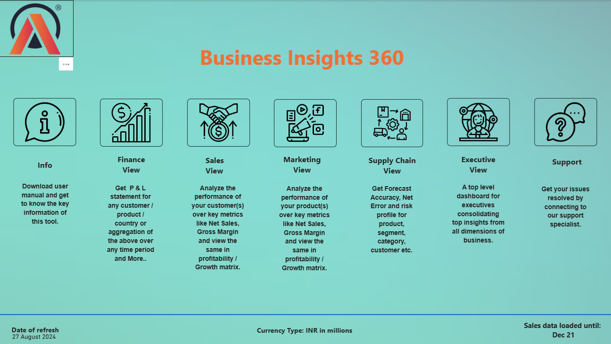
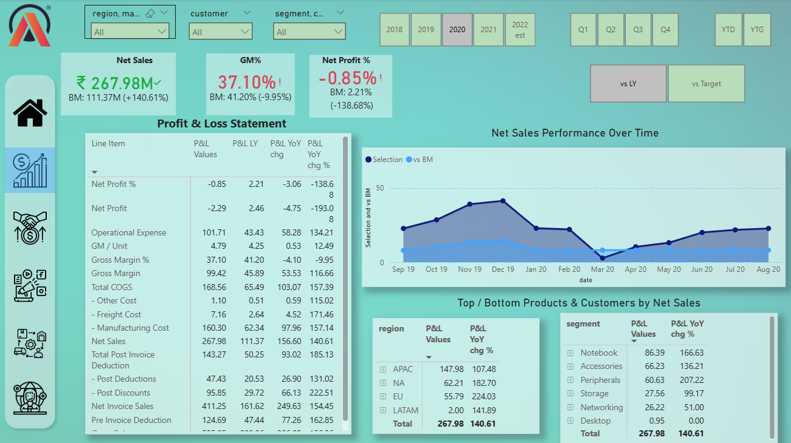
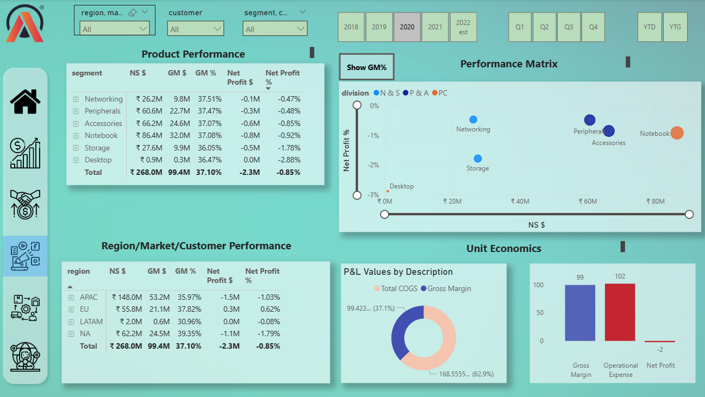
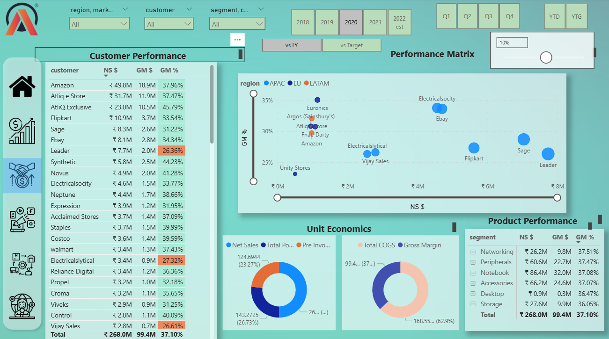
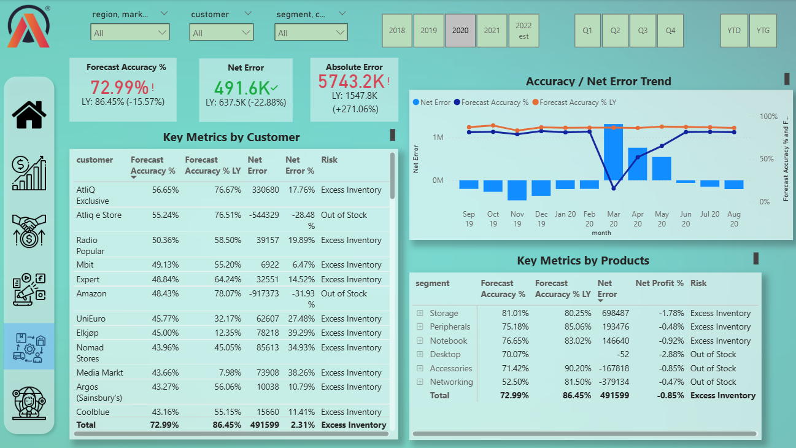

# 🧾 Business Insights 360 - Brick & mortar and e-commerce

---
<h2>Summary</h2>

- Designed a multi-view Power BI dashboard for Atliq Hardware, enabling six departments (Sales, Finance, Supply Chain, Executive, Marketing, and Products) to analyze sales trends, drive data-driven decisions, enhance business processes by 10%, and reduce data- related expenses by 20%.
- Imported data from 2 different data sources (MySQL and Excel) with more than 1 million records and performed data modeling.
- Optimized the report using DAX studio, which saved 30% of storage and optimized performance by 10%.

---
<h2>Dashboard Images</h2>

- Power BI Dashboard shows:
  - Home Page
  - Finance View
  - Marketing View
  - Sales View
  - Supply Chain View

---
DASHBOARD AVAILABLE AT :
https://app.powerbi.com/groups/me/reports/d689a655-2ec6-44ca-bd50-f2f4df27397a/49e244c012cafec8773c?experience=power-bi 
---
<h2>Author & Contact</h2>

**Nikhil S Kumar**  
Business Analyst
📧 Email: n8nikhil@gmail.com
🔗 [LinkedIn](https://www.linkedin.com/in/nikhil-kumar-0a1720129/)

